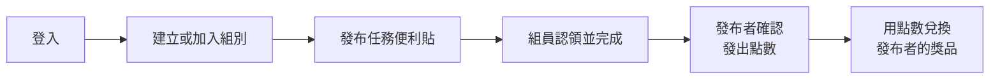
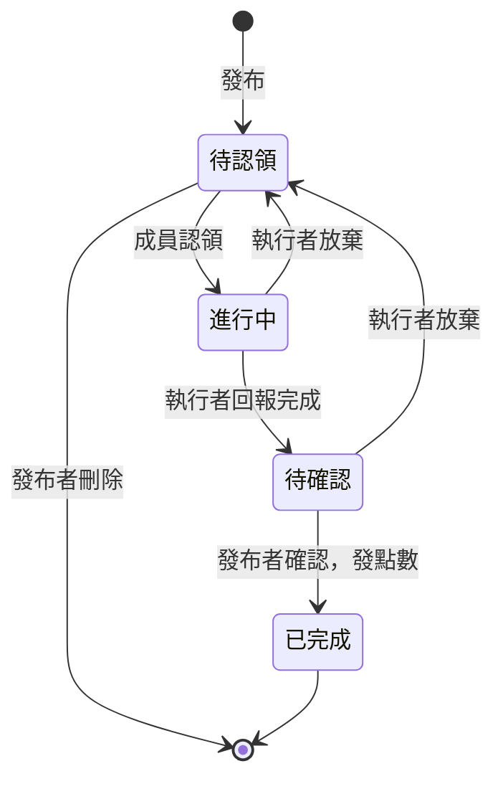

# 冰箱便利貼任務板｜規格文件 v0.1

最後更新：2026-09-18

## 1. 概述

一個以「冰箱門上的便利貼」為靈感的任務分配板：組員把任務貼在共用的任務版上，其他人自由認領，完成後賺取發布者的個人點數，再拿點數向該發布者兌換獎品。

適用對象：家庭與工作團隊皆可使用，規則設計以通用為原則。

專案目的：練習 vibe coding 的規劃與執行。本文件是交給 AI 開發時的規格依據，規則未寫在這裡的，AI 不應自行決定。

核心流程：

## 2. 名詞定義

| 名詞 | 定義 |
| --- | --- |
| 會員 | 用 email＋密碼註冊的使用者，可加入多個組別 |
| 組別 | 一群成員共用一個任務版；點數與獎品都只在該組內有效 |
| 成員 | 屬於某組別的會員，所有成員權限相同 |
| 任務 | 貼在任務版上的便利貼，帶有發布者設定的點數 |
| 發布者 | 建立該任務的成員 |
| 執行者 | 認領該任務的成員 |
| 個人點數 | 每個成員發行自己的點數，例如「B 的點數」只能向 B 兌換獎品 |
| 獎品 | 成員自己上架、設定兌換點數與庫存的項目 |
| 兌換紀錄 | 每次兌換產生的一筆紀錄，狀態為待兌現、已兌現或已失效 |
| 點數交易 | 每一次點數變動的帳本紀錄（賺取、兌換、作廢） |

## 3. 會員與登入

第一版只提供 email＋密碼，第三方登入之後再加。

- 註冊：email、密碼、顯示名稱；email 不可重複
- 密碼必須雜湊後儲存，不可存明碼
- 登入成功後發給 token，後續 API 與 WebSocket 連線都要驗證
- 登入後的首頁是「我的組別」列表

## 4. 組別

組別內沒有角色之分，所有成員權限相同。

- 任何會員都可以建立組別，建立者自動成為第一位成員
- 一個會員可以加入多個組別
- 加入方式：輸入邀請碼，或點擊邀請連結
- 邀請連結 = 帶有邀請碼的網址，後端只需一套驗證邏輯
- 未登入者點邀請連結：先導向登入／註冊，完成後自動加入該組
- 已是成員者再次使用邀請碼：直接進入該組，不重複加入
- 不提供踢人功能，成員只能自己離開
- 最後一位成員離開時，組別自動解散，所有資料刪除

## 5. 任務

任務為一次性，貼在組別任務版上由成員自由認領，完成後需發布者確認才發點數。

**發布**

- 欄位：標題、說明（選填）、點數、截止日期（選填）
- 點數由發布者設定，系統限制為 1～100 的整數，前後端都要檢查
- 點數以發布者的個人點數發出
- 截止日期只顯示，過期不影響任何規則
- 只有「待認領」時，發布者可以修改或刪除任務

**認領與完成**

- 任何成員都可以認領「待認領」的任務，先認領者得
- 發布者不能認領自己發布的任務
- 一個任務同時只能有一位執行者
- 執行者做完後按「回報完成」，由發布者按「確認」
- 發布者確認後，執行者獲得該任務的點數，任務變為已完成
- 執行者在「進行中」或「待確認」時都可以放棄，任務退回「待認領」
- 任務在「待確認」時，執行者可以發出提醒；發布者下次登入時跳出提醒列表

**狀態流程**

驗收條件：兩個帳號同時認領同一個任務，只有一個成功，另一個收到「已被認領」的提示。

## 6. 點數

每個成員發行自己的點數，點數依組別分開計算，不跨組通用。

- 餘額的單位是「誰持有 × 誰發行 × 哪個組別」，例如：A 在家庭組持有 30 點 B 的點數
- 所有變動都寫成一筆點數交易：賺取（任務確認）、扣除（兌換）、作廢（離開組別）
- 餘額不可為負數
- 成員可以查看自己持有各人點數的餘額與歷史紀錄

## 7. 獎品與兌換

申請兌換時直接扣點與扣庫存，並產生一筆待兌現的兌換紀錄。

**獎品設定**

- 每個成員可以上架自己的獎品：名稱、說明（選填）、兌換點數、庫存數量
- 庫存歸零後顯示為「已換完」，不可再兌換
- 只能用「獎品提供者發行的點數」兌換該獎品
- 上架後可以調整庫存或下架，但兌換點數不可修改

**兌換流程**

1. A 選擇 B 的獎品，按「兌換」
2. 後端檢查：A 持有的 B 點數足夠、庫存 > 0
3. 一次完成：扣 A 的點數、庫存 -1、建立兌換紀錄（待兌現）
4. B 在現實中兌現後，按「已兌現」

步驟 3 必須是同一個資料庫交易：任一步失敗就全部不生效。

驗收條件：庫存剩 1 時兩人同時兌換，只有一人成功，另一人的點數不被扣除。

## 8. 離開組別

B 離開組別時，與 B 有關的點數、獎品與任務依下表處理，全部在同一個資料庫交易中完成。

| 對象 | 處理方式 |
| --- | --- |
| B 持有的他人點數 | 作廢 |
| 其他人持有的 B 點數 | 作廢 |
| B 上架的獎品 | 下架 |
| B 尚未兌現的兌換紀錄 | 標記為已失效，不退點 |
| B 發布的任務 | 全部下架（含進行中、待確認） |
| B 正在執行的任務 | 放回任務版，狀態改回待認領 |
| B 是最後一位成員 | 組別解散 |

離開前需跳出確認視窗，列出將被作廢的點數、下架的項目與會失效的兌換紀錄；只做提醒，確認後即可離開。

## 9. 任務版畫面與互動

任務以便利貼形式顯示在任務版上，可自由拖曳，位置全組共用。

- 桌機：固定大小的任務版，便利貼可拖曳，座標以絕對像素存在任務資料裡
- 桌機：只有發布者能拖曳自己的便利貼，放開後儲存
- 手機：便利貼自動排列，不提供拖曳，不使用儲存的座標
- 便利貼上顯示：標題、點數、發布者、狀態、執行者（如有）、截止日期（如有）
- 不同狀態要有明顯的視覺差異

其他頁面：我的組別列表、獎品列表（依提供者分組）、我的點數與紀錄、兌換紀錄。

## 10. 即時同步

同組成員的操作會即時反映在其他成員的畫面上，不需重新整理。

- 需要即時廣播的事件：發布任務、認領、回報完成、確認、拖曳位置、任務下架、獎品變動、成員加入／離開
- 廣播範圍只限該組別的成員（一個組別一個連線房間）
- 所有操作仍以後端資料庫為準：先寫入成功，再廣播
- 搬單與兌換的「只有一人成功」由後端保證，不依賴前端狀態
- 拖曳中不即時廣播，放開後才儲存並廣播最終位置
- 斷線重連後，重新取得整個任務版的最新狀態

## 11. 技術選型

選擇熟悉的技術，確保能看懂並驗收 AI 產出的程式碼。

| 層 | 技術 |
| --- | --- |
| 前端 | Vue 3（Composition API）、Vite |
| 後端 | Node.js、Express |
| 資料庫 | MongoDB，跑在本地 Docker 容器 |
| 即時同步 | Socket.IO |
| 驗證 | email＋密碼、密碼雜湊、token |
| 執行環境 | Docker Compose |

**Docker 一鍵執行**

- 一行 `docker compose up` 啟動三個服務：前端、後端、MongoDB
- 資料存在本地 Docker volume，關掉容器後資料仍保留
- MongoDB 必須以單節點 replica set 啟動，第 5、7、8 節需要的交易才能運作
- 連線字串、token 密鑰等設定放在 `.env`，並提供 `.env.example`
- 驗收條件：只裝了 Docker 的電腦，clone 後一行指令就能打開網頁並登入

**展示用預設資料（seed）**

- 預先寫入 3～4 個可登入的帳號，同屬一個展示組別；密碼同樣雜湊後儲存
- 展示組別內預先放好：涵蓋所有狀態的任務、各成員的獎品、點數餘額與兌換紀錄
- 點數餘額必須由點數交易紀錄產生，不可直接寫入數字
- seed 只在資料庫為空時自動執行，不覆蓋既有資料
- 另提供一個重置指令：清空資料庫後重新寫入預設資料
- 展示帳密寫在 README，登入頁不列出

參考文件：[Socket.IO](https://socket.io/docs/v4/)、[MongoDB Transactions](https://www.mongodb.com/docs/manual/core/transactions/)

## 12. 第一版不做

AI 開發時不應實作以下功能。

- 重複任務（每天／每週）
- 第三方登入
- 角色與權限分級、踢人
- 指定任務給特定成員
- 點數上下限由組別自訂

## 13. 尚未決定

原先列出的事項已全部定案，並寫入對應章節。開發中發現新的未定規則時，先加到這裡再決定。
